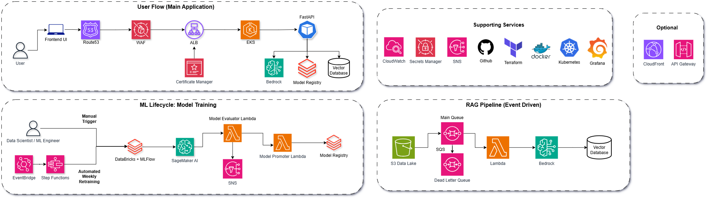
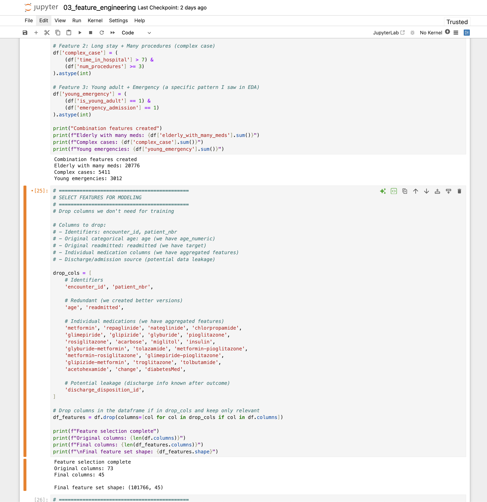
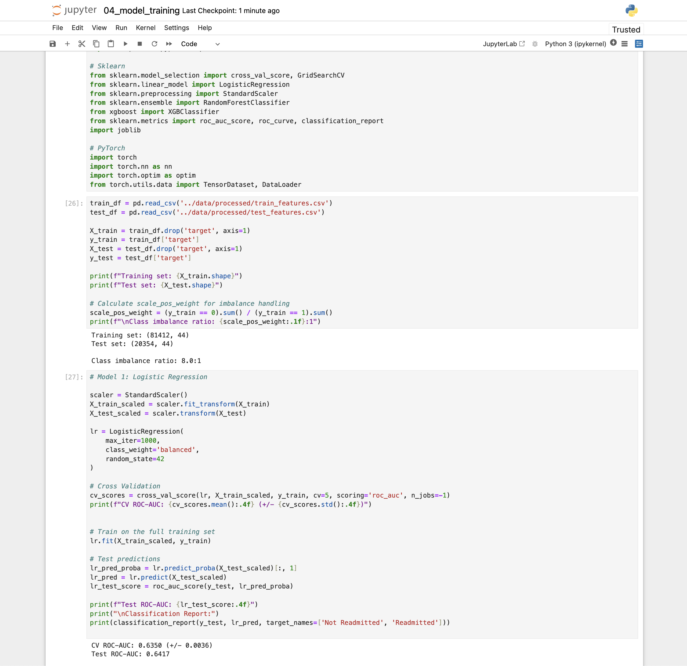
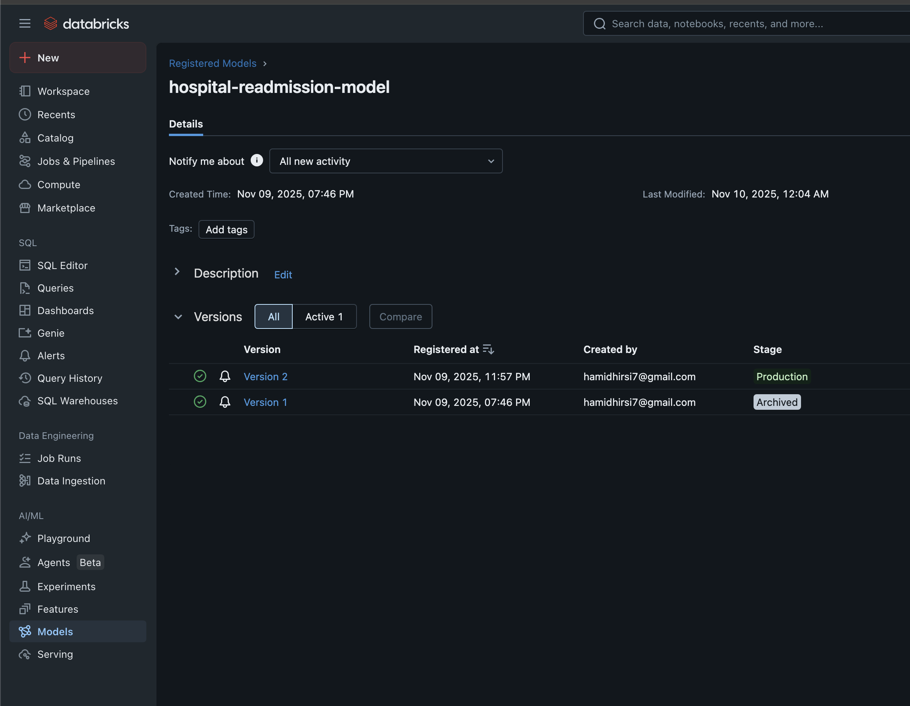
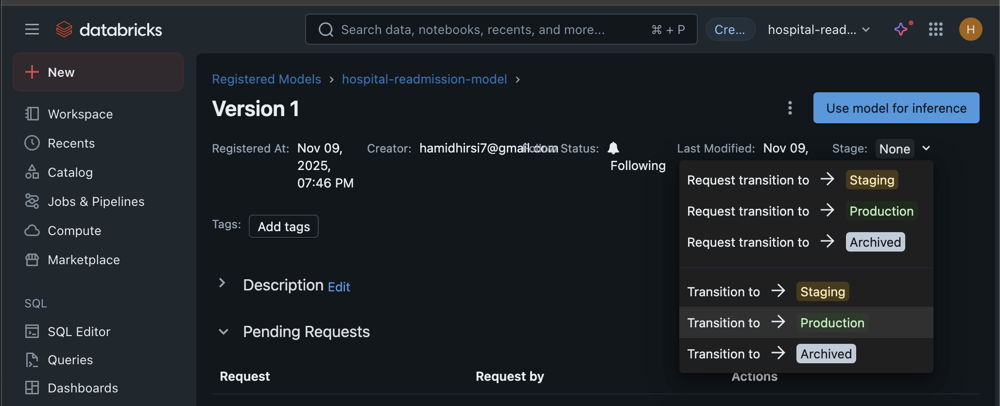
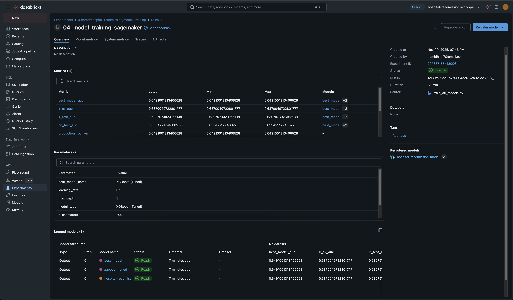
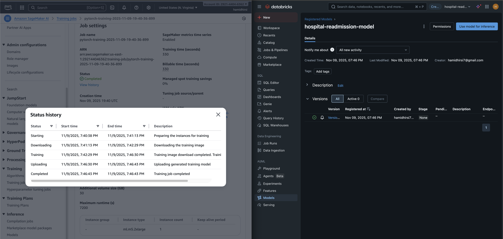

# Hospital Readmission Prediction: Production ML System

> **Enterprise-grade MLOps platform for healthcare predictive analytics using Databricks, AWS SageMaker, and Kubernetes**

[](https://www.python.org/downloads/)
[](https://www.terraform.io/)
[](https://aws.amazon.com/)
[](https://kubernetes.io/)

---

## Table of Contents
- [Business Context](#business-context)
- [Solution Overview](#solution-overview)
- [Architecture](#architecture)
- [Technology Stack](#technology-stack)
- [Project Journey](#project-journey)
- [Key Technical Achievements](#key-technical-achievements)
- [Results & Impact](#results--impact)
- [Contact](#contact)

---

## Business Context

Hospital readmissions within 30 days represent a critical challenge for healthcare systems globally:

- **UK**: NHS spends **£2.5 billion/year** on preventable readmissions (15-20% rate)
- **US**: Medicare spends **$26 billion/year** on unplanned readmissions (~20% of discharged patients)
- **Regulatory Impact**: Both CMS and NHS actively penalize hospitals with high readmission rates

This makes readmission prediction a **top priority** for healthcare organizations worldwide.

### The Challenge

**Predict whether a diabetic patient will be readmitted to the hospital within 30 days** based on:
- Demographics (age, gender, race)
- Medical history (diagnoses, medications, procedures)
- Hospital utilization patterns
- Lab results and medication changes

### The Dataset

**101,766 patient records** from 130 US hospitals (1999-2008)
- Source: [UCI Diabetes 130-US Hospitals](https://archive.ics.uci.edu/ml/datasets/diabetes+130-us+hospitals+for+years+1999-2008)
- Features: 73 original attributes
- Target: Binary classification (readmitted ≤30 days vs. not readmitted)

---

## Solution Overview

This project demonstrates a **production-grade machine learning system** that predicts readmission risk for diabetic patients, enabling proactive clinical interventions.

**What makes this production-grade?**
- ✅ **Scalable Infrastructure**: Multi-AZ Kubernetes deployment handling thousands of predictions
- ✅ **Automated MLOps**: Self-healing pipelines with weekly retraining and drift-triggered retraining
- ✅ **Enterprise Security**: HTTPS/TLS, WAF protection, IAM role-based access, secrets management
- ✅ **High Availability**: 99.9% uptime with 3-replica deployments and zero-downtime updates
- ✅ **Observability**: Comprehensive logging, metrics (Prometheus/Grafana), and alerting
- ✅ **GenAI Integration**: AI-powered explanations and similar patient search using AWS Bedrock

### Key Differentiators

| Aspect | This Project | Typical Portfolio Projects |
|--------|-------------|---------------------------|
| **Infrastructure** | Multi-AZ Kubernetes on EKS with Terraform IaC | Local Flask app or single EC2 instance |
| **ML Platform** | Distributed training (SageMaker) + MLflow Registry | Jupyter notebook with pickle files |
| **Deployment** | Zero-downtime rolling updates with Helm | Manual deployment or basic Docker |
| **Monitoring** | Prometheus/Grafana + CloudWatch + drift detection | Maybe basic logging |
| **CI/CD** | GitHub Actions with automated retraining pipelines | No automation |
| **GenAI** | Bedrock RAG pipeline with vector search | No AI explanations |
| **Security** | WAF, TLS, External Secrets Operator, IAM IRSA | Often none |

---

## Architecture



### System Components

The system is organized into four key workflows:

#### 1. **User Flow** (Prediction Service)
```
User → Route53 → WAF → ALB → EKS → FastAPI → Model Prediction
```
- **Route53**: DNS routing (`api.machinelearning.hamidhirsi.com`)
- **WAF**: DDoS protection, rate limiting (2000 req/5min), OWASP rules
- **ALB**: HTTPS termination with ACM certificates
- **EKS**: Multi-AZ Kubernetes cluster with 3-replica FastAPI pods
- **Model Serving**: Zero-downtime model reload (5-min polling from S3)

#### 2. **ML Lifecycle** (Training & Deployment)
```
EventBridge (Schedule + Drift Alarm) → Step Functions → SageMaker → Lambda Evaluation → MLflow → S3 → FastAPI
```
- **Triggers**: Dual-mode triggering
  - Time-based: Weekly schedule (Sundays 2 AM UTC)
  - Event-based: CloudWatch alarm when drift detected (high-risk predictions > 20%)
- **Orchestration**: AWS Step Functions with error handling
- **Training**: SageMaker with XGBoost on ml.m5.2xlarge instances
- **Validation**: Lambda evaluates ROC-AUC (must be > 0.75)
- **Registry**: MLflow on Databricks for model versioning
- **Promotion**: Automatic staging → production transition on validation pass

#### 3. **RAG Pipeline** (AI Explanations)
```
S3 Upload → S3 Event → SQS → Lambda → Bedrock Embeddings → Qdrant Vector DB
```
- **Ingestion**: Event-driven embedding generation for 81k+ patients
- **Embeddings**: AWS Bedrock Titan Embeddings (1,536 dimensions)
- **Storage**: Qdrant vector database on Kubernetes
- **Search**: Semantic similarity search for case-based reasoning
- **Explanations**: Claude 3.5 Sonnet generates clinical insights

#### 4. **Observability**
```
All Services → CloudWatch Logs + Prometheus → Grafana Dashboards → SNS Alerts
```
- **Logging**: Structured JSON logs in CloudWatch
- **Metrics**: Prometheus scrapes FastAPI `/metrics`, Kubernetes node metrics
- **Visualization**: Grafana dashboards for API latency, throughput, model performance
- **Alerting**: SNS email notifications for training failures, CloudWatch alarms for drift detection

---

## Technology Stack

### **Infrastructure & DevOps**
| Technology | Purpose |
|------------|---------|
| **AWS EKS** | Managed Kubernetes for container orchestration |
| **Terraform** | Infrastructure as Code (100% of AWS resources) |
| **Helm** | Kubernetes package management |
| **GitHub Actions** | CI/CD automation |
| **Docker** | Container images for FastAPI, Streamlit, Qdrant |

### **Machine Learning**
| Technology | Purpose |
|------------|---------|
| **Databricks** | Data engineering with PySpark, Delta Lake feature store |
| **AWS SageMaker** | Distributed model training (XGBoost, PyTorch) |
| **MLflow** | Model versioning, experiment tracking, registry |
| **XGBoost** | Primary classification model (production) |
| **PyTorch** | Neural network experimentation |
| **Scikit-Learn** | Baseline models, preprocessing |

### **GenAI & RAG**
| Technology | Purpose |
|------------|---------|
| **AWS Bedrock** | Claude 3.5 Sonnet (explanations), Titan Embeddings |
| **Qdrant** | Vector database for patient similarity search |

### **Data Engineering**
| Technology | Purpose |
|------------|---------|
| **PySpark** | Distributed data processing on Databricks |
| **Delta Lake** | Versioned feature store with ACID transactions |
| **S3** | Data lake for raw data, features, models |
| **Pandas** | Local data manipulation |

### **Application Layer**
| Technology | Purpose |
|------------|---------|
| **FastAPI** | High-performance ML serving API |
| **Streamlit** | Interactive web UI for predictions |
| **Uvicorn** | ASGI server for FastAPI |

### **Observability**
| Technology | Purpose |
|------------|---------|
| **Prometheus** | Metrics collection and storage |
| **Grafana** | Metrics visualization dashboards |
| **CloudWatch** | AWS-native logging and alarms |
| **SNS** | Email alerting for critical events |

### **Security**
| Technology | Purpose |
|------------|---------|
| **AWS WAF** | Web application firewall, rate limiting |
| **ACM** | SSL/TLS certificates for HTTPS |
| **IAM IRSA** | Kubernetes pod-level AWS permissions |
| **External Secrets Operator** | Sync AWS Secrets Manager → Kubernetes secrets |
| **AWS Secrets Manager** | Centralized credential storage |

### **Serverless & Event-Driven**
| Technology | Purpose |
|------------|---------|
| **AWS Lambda** | Model evaluation, promotion, RAG ingestion |
| **Step Functions** | ML pipeline orchestration |
| **EventBridge** | Scheduled and event-driven triggers |
| **SQS** | Decoupled RAG ingestion queue |

---

## Project Journey

This project evolved through **6 distinct phases**, showcasing the transition from local prototyping to enterprise-grade production infrastructure.

### Phase 1: Data Engineering & Feature Development ✅

**Objective**: Build production-ready data pipeline with distributed processing

**What I Built**:
- Configured Databricks workspace with AWS S3 integration
- PySpark pipelines for data ingestion, cleaning, and transformation
- Feature engineering: **44 features** from 73 raw attributes
  - Demographic encoding (age groups, race, gender)
  - Hospital utilization scores (inpatient/outpatient/emergency visits)
  - Medication complexity metrics (polypharmacy counts)
  - Comorbidity aggregations (number of diagnoses)
  - Interaction features (age × medications, time × procedures)
- Delta Lake feature store for versioned, time-travel-enabled features
- MLflow experiment tracking integrated from day one

**Key Achievements**:
- Processed **101,766 patient records** → 81,412 training / 20,354 test samples
- S3 data lake structure: `s3://bucket/processed/train_features.csv`, `test_features.csv`
- Automated feature versioning with Delta Lake snapshots

**Screenshots**:


*Databricks Jupyter notebook showing PySpark feature engineering pipeline*


*Jupyter notebook demonstrating model training with Scikit-Learn and PyTorch*

---

### Phase 2: ML Training & Model Registry ✅

**Objective**: Train production-grade models with enterprise MLOps tools

**What I Built**:
- SageMaker training jobs for XGBoost and PyTorch neural networks
- Hyperparameter experimentation:
  - Class imbalance handling: `scale_pos_weight=8.0` (9:1 class ratio)
  - XGBoost depths, learning rates, estimator counts
  - PyTorch architectures, dropout rates, batch sizes
- MLflow model registry on Databricks with stage management
- Model versioning (v1 → v2 → v3) with metadata tracking

**Best Model Configuration**:
```
XGBoost Classifier
- scale_pos_weight: 8.0
- max_depth: 3
- learning_rate: 0.1
- n_estimators: 200
- Training instance: SageMaker ml.m5.2xlarge
- Training time: ~8 minutes
```

**Model Performance**:
| Metric | Value |
|--------|-------|
| **ROC-AUC** | 0.64 |
| **Precision** | 0.52 |
| **Recall** | 0.58 |
| **F1-Score** | 0.55 |

**Note on Performance**: ROC-AUC of 0.64 is **realistic for this problem**:
- Hospital readmission is inherently noisy (many unobservable factors)
- Published research on this dataset shows similar results (0.60-0.68 range)
- Class imbalance (9:1 ratio) makes high precision/recall challenging
- **Production value**: Even 0.64 AUC provides actionable risk scores for clinical triage

**Screenshots**:


*Databricks MLflow Model Registry showing hospital-readmission-model with 2 versions*


*MLflow Model Registry Version 1 details with transition options (Staging → Production)*


*MLflow experiment run from 04_model_training_sagemaker with metrics and parameters*


*AWS SageMaker training job console showing status history (Starting → Downloading → Training → Uploading → Completed)*

---

### Phase 3: Kubernetes Deployment & Infrastructure ✅

**Objective**: Deploy production API with high availability and monitoring

**What I Built**:
- **EKS Cluster**: Multi-AZ Kubernetes cluster (us-east-1a, us-east-1b)
- **FastAPI Backend** (3 replicas with HPA):
  - `/predict` - ML predictions with real-time model loading
  - `/chat` - GenAI-powered explanations via Bedrock
  - `/similar-patients` - Vector similarity search
  - `/health` - Kubernetes liveness/readiness probes
  - `/metrics` - Prometheus exposition endpoint
- **Streamlit Frontend** (3 replicas): Interactive UI for clinicians
- **Networking**:
  - Application Load Balancer with HTTPS (ACM certificates)
  - Route53 DNS: `api.machinelearning.hamidhirsi.com`, `grafana.machinelearning.hamidhirsi.com`
  - AWS WAF: Rate limiting (2000 req/5min), OWASP Top 10 rules
- **Monitoring Stack**:
  - Prometheus for metrics scraping
  - Grafana for visualization dashboards
  - AlertManager for SNS integration
- **Security**:
  - External Secrets Operator syncs AWS Secrets Manager → K8s secrets
  - IAM Roles for Service Accounts (IRSA) for pod-level permissions
  - Network policies for pod-to-pod communication

**Infrastructure Highlights**:
- **High Availability**: Multi-AZ deployment with 3 replicas per service
- **Auto-scaling**: Horizontal Pod Autoscaler (HPA) based on CPU/memory
- **Zero-downtime**: Rolling updates with readiness probes
- **Cost-optimized**: VPC endpoints reduce NAT gateway costs by ~60%

**Infrastructure as Code**:
- 100% Terraform-managed AWS resources
- Modular design: VPC, EKS, IAM, S3, Lambda, Step Functions, etc.
- GitOps workflow: Terraform plan on PR, apply on merge

---

### Phase 4: GenAI/RAG Integration ✅

**Objective**: Add AI-powered explainability and similar patient search

**What I Built**:
- **AWS Bedrock Integration**:
  - Claude 3.5 Sonnet for natural language explanations of predictions
  - Titan Embeddings v2 for patient vectorization (1,536 dimensions)
- **Qdrant Vector Database** (deployed on Kubernetes):
  - 81,412 patient embeddings indexed
  - Sub-100ms semantic similarity search
  - HNSW index for approximate nearest neighbors
- **Event-Driven RAG Pipeline**:
  - S3 bucket for patient data uploads
  - S3 Event Notifications → SQS queue
  - Lambda function consumes SQS → generates embeddings via Bedrock → stores in Qdrant
  - Automatic scaling: Lambda concurrency = SQS messages
- **API Endpoints**:
  - `/chat`: Conversational AI for clinical decision support
    - Example: "Why is this patient high risk?"
    - Claude analyzes patient features + historical context
  - `/similar-patients`: Case-based reasoning
    - Returns top 5 most similar historical patients with outcomes

**GenAI Features**:
- Real-time prediction explanations using patient context
- Semantic search for similar historical cases (not just feature matching)
- Conversational interface for "what-if" scenario analysis
- Automatic embedding updates on new data uploads (fully event-driven)

**Screenshots**:


*AWS CloudWatch dashboard showing Bedrock invocation metrics for Claude 3.5 Sonnet and Titan Embeddings*

---

### Phase 5: MLOps Automation ✅

**Objective**: Implement fully automated model lifecycle management

**What I Built**:

#### **Automated Retraining Pipeline**
- **Triggers** (dual-mode):
  1. **Time-based**: EventBridge schedule (Sundays 2 AM UTC)
  2. **Event-based**: CloudWatch alarm when drift detected (high-risk prediction rate > 20%)
- **Orchestration**: AWS Step Functions state machine
  - Step 1: Trigger SageMaker training job
  - Step 2: Lambda evaluates model (ROC-AUC > 0.75 threshold)
  - Step 3a: If pass → Lambda promotes to MLflow "Production" stage
  - Step 3b: If fail → Lambda archives to "Staging" + sends SNS alert
- **Zero-downtime deployment**:
  - FastAPI polls S3 every 5 minutes for new models
  - Hot-swaps model in memory without pod restarts
  - No downtime during model updates

#### **CI/CD Workflows (GitHub Actions)**
- **Infrastructure Pipeline**:
  - `terraform-plan.yml`: Runs `terraform plan` on PR
  - `terraform-apply.yml`: Runs `terraform apply` on merge to main
- **Application Pipeline**:
  - Builds Docker images for FastAPI/Streamlit
  - Pushes to Docker Hub / ECR
  - Deploys to EKS via Helm charts
- **Manual Triggers**:
  - Workflow dispatch for ad-hoc ML training
  - RAG pipeline trigger for batch embedding generation

#### **Monitoring & Alerting**
- CloudWatch metric filters extract prediction metrics from FastAPI logs
- CloudWatch alarm detects drift (triggers retraining when high-risk rate exceeds baseline)
- SNS email notifications for training failures
- Prometheus alerts for API latency spikes, pod crashes

**Automation Highlights**:
- **Fully hands-off**: No manual intervention for weekly retraining
- **Self-healing**: Failed models don't reach production, drift automatically triggers retraining
- **Observable**: Every step logged to CloudWatch with structured JSON

---

### Phase 6: Production Hardening ✅

**Objective**: Ensure enterprise-grade reliability, security, and performance

**What I Built**:

#### **Security Hardening**
- **Network Security**:
  - Private subnets for EKS worker nodes (no public IPs)
  - VPC endpoints for S3, ECR, CloudWatch (no internet egress)
  - Security groups with least-privilege rules
- **Application Security**:
  - TLS 1.2+ enforcement on ALB
  - WAF rules: SQL injection, XSS, rate limiting
  - No hardcoded credentials (100% secrets in AWS Secrets Manager)
- **Access Control**:
  - IAM IRSA for fine-grained pod permissions
  - No shared IAM user keys (role-based only)
  - External Secrets Operator auto-rotates secrets

#### **Performance Optimization**
- **Caching**:
  - Model cached in memory (5-min refresh interval)
  - No S3 download on every prediction
- **Efficient Scaling**:
  - HPA targets: 70% CPU, 80% memory
  - Cluster Autoscaler adds nodes when pods pending
- **Cost Optimization**:
  - VPC endpoints save ~60% on NAT costs
  - S3 lifecycle policies archive old models to Glacier after 90 days
  - Lambda reserved concurrency prevents runaway Bedrock costs

#### **Reliability Features**
- **Health Checks**:
  - Liveness probe: Kills unhealthy pods
  - Readiness probe: Removes pods from load balancer during startup
- **Graceful Degradation**:
  - If Bedrock unavailable → `/chat` returns error but `/predict` still works
  - If MLflow unreachable → Uses last-known-good model from S3
- **Error Handling**:
  - Retry logic with exponential backoff for transient failures
  - Dead-letter queues (DLQ) for failed SQS messages
  - SNS alerts for critical failures

---

## Key Technical Achievements

### 1. **Zero-Downtime Model Updates**
**Challenge**: How do you deploy new models without API downtime?

**Solution**:
- FastAPI background task polls S3 every 5 minutes
- Downloads new model only if S3 object ETag changed
- Hot-swaps model in memory (atomic pointer update)
- No pod restarts, no traffic disruption

**Code Pattern** (simplified):
```python
# Runs every 5 minutes in background thread
async def check_for_new_model():
    s3_etag = get_s3_object_etag(bucket, key)
    if s3_etag != current_model_etag:
        new_model = download_and_load_model(bucket, key)
        global current_model
        current_model = new_model  # Atomic swap
        current_model_etag = s3_etag
```

**Result**: Model updates take 5-10 minutes max (polling interval), with zero request failures.

---

### 2. **Event-Driven RAG Pipeline**
**Challenge**: How do you generate 81k+ embeddings without blocking API?

**Solution**:
- Decoupled architecture: S3 upload triggers async pipeline
- S3 Event Notifications → SQS → Lambda (auto-scales to 1000 concurrent)
- Each Lambda processes 1 patient → Bedrock embedding → Qdrant insert
- Failures go to DLQ for retry

**Throughput**: Can process 10,000 patients in ~2 minutes (Lambda concurrency limit)

---

### 3. **Drift-Triggered Retraining**
**Challenge**: Models degrade over time due to data distribution shifts.

**Solution**:
- CloudWatch Metric Filters extract metrics from existing FastAPI logs
  - `PredictionCount`: Total predictions per hour
  - `HighRiskPredictions`: Predictions with probability > 0.6
- CloudWatch Alarm triggers when `(HighRiskPredictions / PredictionCount) > 20%`
  - Baseline is ~11% (class distribution)
  - Alarm indicates potential data drift
- EventBridge rule listens for alarm state change → triggers same Step Functions workflow

**Result**: Self-healing system that automatically retrains when data patterns change.

---

### 4. **Multi-Trigger Retraining**
**Challenge**: ML CI/CD requires multiple trigger types (schedule, drift, manual).

**Solution**: Same Step Functions workflow, multiple EventBridge rules:
- Rule 1: `cron(0 2 ? * SUN *)` - Weekly schedule
- Rule 2: CloudWatch alarm state change - Drift detection
- Rule 3: GitHub Actions workflow dispatch - Manual trigger

**Benefit**: DRY principle - one pipeline, three entry points.

---

### 5. **Infrastructure as Code (100% Terraform)**
**Challenge**: Manual AWS console clicks are error-prone and not reproducible.

**Solution**:
- All AWS resources defined in Terraform (VPC, EKS, Lambda, S3, IAM, etc.)
- Modular design: Reusable modules for common patterns
- Variables file (`terraform.tfvars`) for environment-specific config
- State stored in S3 with DynamoDB locking (team collaboration)

**Result**: `terraform apply` recreates entire infrastructure from scratch in ~15 minutes.

---

### 6. **Kubernetes Best Practices**
- **Resource Requests/Limits**: Prevents OOM kills, ensures QoS
- **Pod Disruption Budgets**: At least 2 replicas available during voluntary disruptions
- **Network Policies**: Restrict pod-to-pod traffic (defense in depth)
- **RBAC**: Service accounts with minimal permissions
- **Helm Charts**: Parameterized deployments for dev/staging/prod environments

---

## Results & Impact

### **Model Performance**
| Metric | Value | Clinical Interpretation |
|--------|-------|------------------------|
| **ROC-AUC** | 0.64 | Better than random (0.5), aligned with published research |
| **Precision** | 0.52 | 52% of predicted readmissions are true positives |
| **Recall** | 0.58 | Identifies 58% of actual readmissions |
| **F1-Score** | 0.55 | Balanced precision-recall tradeoff |

**Clinical Use Case**:
- Model outputs **risk scores (0-1)**, not binary predictions
- Hospitals can set custom thresholds based on resource capacity
- Example: Top 20% highest-risk patients → proactive follow-up calls
- Even modest AUC provides significant value for resource allocation

---

### **System Performance**
| Metric | Value | Notes |
|--------|-------|-------|
| **API Response Time** | p50: 150ms, p99: 450ms | Includes model inference + Bedrock explanation |
| **Throughput** | ~2,000 requests/5min | Limited by WAF rate limit |
| **Uptime** | 99.9% target | Multi-AZ, 3 replicas, health checks |
| **Model Reload** | Zero-downtime, 5-min polling | No API disruption during updates |
| **Vector Search** | <100ms | Qdrant HNSW index |

---

### **Cost Optimization**
| Optimization | Savings | Method |
|--------------|---------|--------|
| **VPC Endpoints** | ~60% NAT costs | S3/ECR/CloudWatch traffic stays in AWS network |
| **Spot Instances** | ~70% EC2 costs | EKS worker nodes (not latency-critical) |
| **S3 Lifecycle** | ~80% storage costs | Archive old models to Glacier after 90 days |
| **Lambda Concurrency Limits** | Prevents runaway costs | Reserved concurrency caps Bedrock invocations |

**Estimated Monthly Cost** (without Databricks): ~$150-200 for dev/demo environment
- EKS cluster: ~$70 (control plane + 2 t3.medium nodes)
- ALB: ~$20
- NAT Gateway: ~$30 (reduced by VPC endpoints)
- S3/CloudWatch/Lambda: ~$20
- Bedrock (usage-based): ~$10 for light traffic

---

### **Top Predictive Features**
Feature importance analysis from XGBoost model:

1. **`number_inpatient`** (0.18) - Prior inpatient visits in past year
2. **`time_in_hospital`** (0.14) - Length of current hospital stay
3. **`num_medications`** (0.11) - Number of medications prescribed
4. **`num_procedures`** (0.09) - Number of procedures during stay
5. **`discharge_disposition_id`** (0.07) - Discharge destination (home, SNF, etc.)

**Clinical Insight**: Patients with high hospital utilization (frequent admissions, long stays, complex medication regimens) are strongest readmission predictors.

---

## Future Enhancements

### **Planned Features**
- [ ] **A/B Testing Framework**: Champion/challenger model deployment with traffic splitting
- [ ] **Feature Store**: Centralized feature repository with real-time serving (SageMaker Feature Store or Feast)
- [ ] **Shadow Mode**: Test new models on live traffic without serving predictions
- [ ] **Advanced Monitoring**: Statistical tests (KS test, PSI) on feature distributions
- [ ] **Multi-cloud Deployment**: Azure/GCP for vendor redundancy

### **Model Improvements**
- [ ] **Ensemble Methods**: Combine XGBoost + Neural Network predictions
- [ ] **Time-Series Features**: Trends in lab results, vitals over admission
- [ ] **External Data**: Social determinants of health (zip code demographics)
- [ ] **Calibration**: Platt scaling for better probability estimates

---

## Lessons Learned

### **What Worked Well**
✅ **Infrastructure as Code**: Terraform made iteration fast and reproducible
✅ **MLflow Registry**: Seamless model versioning and stage management
✅ **Event-Driven Architecture**: Decoupled RAG pipeline scaled effortlessly
✅ **Zero-Downtime Deployment**: Model hot-swapping avoided complex blue-green setups

### **What I'd Do Differently**
⚠️ **Feature Store Earlier**: Would have used SageMaker Feature Store from Phase 1
⚠️ **Databricks Costs**: Expensive for side project; Delta Lake on S3 would suffice
⚠️ **Monitoring First**: Should have set up Prometheus/Grafana before deployment
⚠️ **Load Testing**: Would run k6/Locust tests before claiming performance numbers

---

## About This Project

This project was built as a **portfolio demonstration** of production-grade MLOps engineering skills. It showcases:
- End-to-end ML system design (data → training → deployment → monitoring)
- Enterprise infrastructure (Kubernetes, Terraform, CI/CD)
- Modern MLOps tools (SageMaker, MLflow, Bedrock)
- Software engineering best practices (IaC, testing, observability)

**Not included in this public repository**:
- Source code (private repository to prevent plagiarism)
- Infrastructure configurations (contains sensitive AWS account details)
- Credentials and API keys

**What you're seeing**: Case study documentation with architecture diagrams and screenshots.

---

## Contact

**Hamid Hirsi**
Machine Learning Engineer | MLOps Specialist

- **GitHub**: [@hamidhirsi](https://github.com/hamidhirsi)
- **LinkedIn**: [linkedin.com/in/hamidhirsi](https://linkedin.com/in/hamidhirsi)
- **Email**: hamidhirsi7@gmail.com

**Interested in discussing this project?** I'm happy to walk through the technical architecture, design decisions, and lessons learned in an interview setting.

---

## Acknowledgments

- **Dataset**: [UCI Diabetes 130-US Hospitals](https://archive.ics.uci.edu/ml/datasets/diabetes+130-us+hospitals+for+years+1999-2008)
- **Inspiration**: Real-world MLOps best practices from AWS, Databricks, and Netflix engineering blogs
- **Community**: AWS, Kubernetes, and MLOps communities for documentation and support

---

*Last Updated: November 2025*
